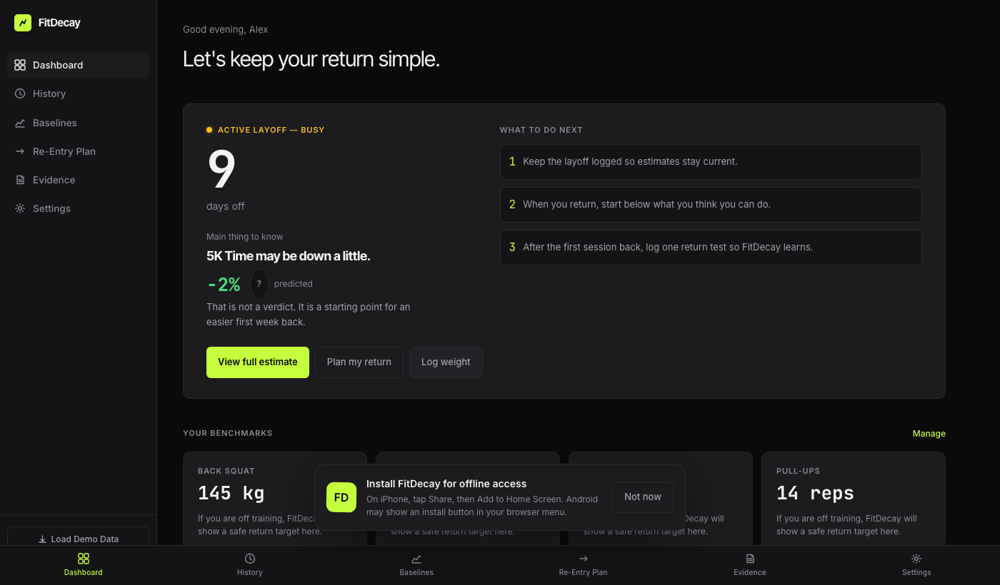
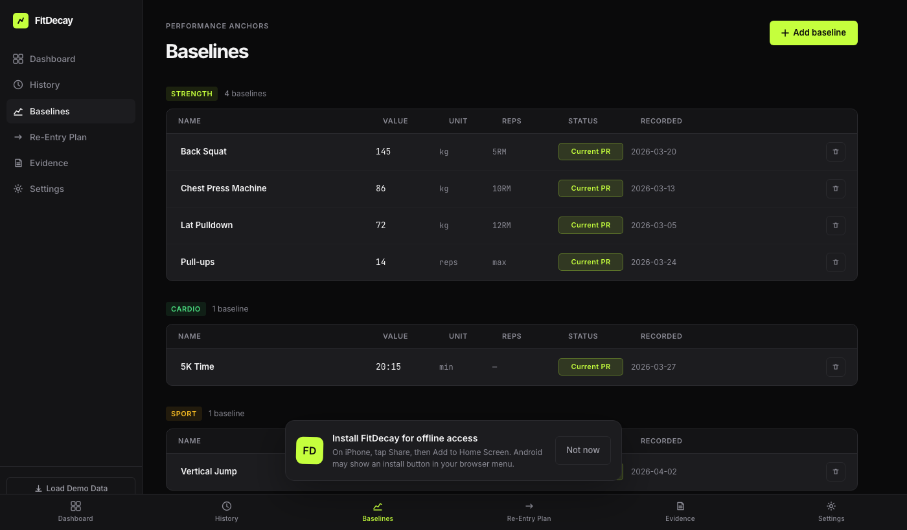
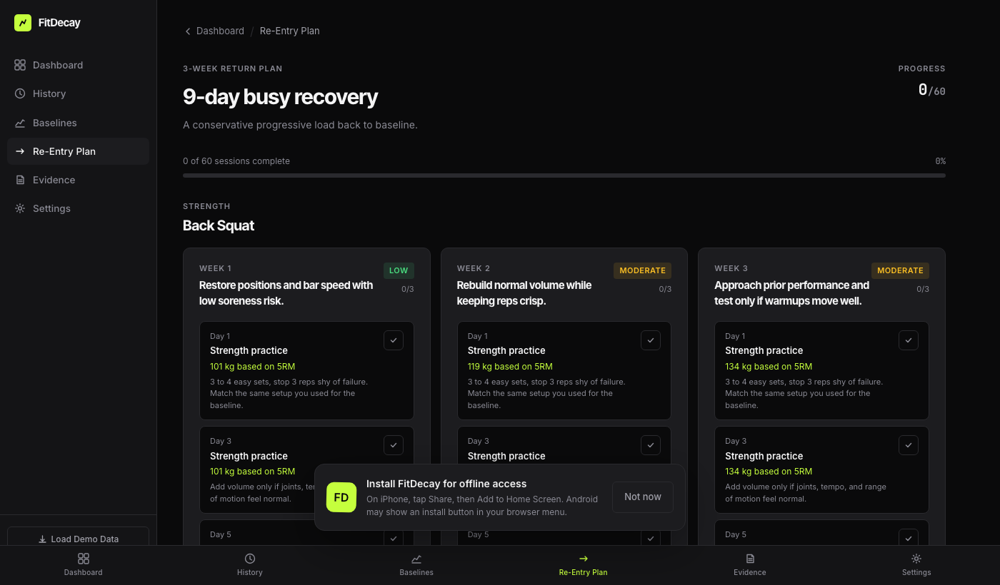

# FitDecay

**FitDecay** predicts how much fitness you lose during a training break and tells you exactly where to start when you return — so your first week back doesn't wreck you.

Live app: https://fitdecay.vercel.app



## What It Does

Most people return from a break and jump back to where they left off. FitDecay stops that mistake. Log a layoff, set your baselines, and the app applies sport-science deconditioning models to estimate how much each metric (strength, cardio, power) has slipped. You get a personalized re-entry target — conservative enough to be safe, specific enough to be useful.

- **Decay modeling** — separate curves for strength, cardiovascular endurance, and sport-specific performance based on established deconditioning research
- **Personal baselines** — track PRs across strength, cardio, sport, and mobility; FitDecay anchors predictions to your actual numbers
- **Re-Entry Plan** — generates a first-session target for each benchmark so you know exactly where to start
- **Evidence log** — record return tests after your first session back; the model calibrates to your real-world results
- **Activity-level modifiers** — "complete rest" vs. "light activity" during the break affects the predicted decay rate
- **Layoff history** — track multiple layoffs over time and see how each one affected your fitness trajectory





## Tech Stack

- React 19
- TypeScript
- Vite
- Recharts
- Framer Motion
- localStorage persistence (no backend required)

## Run Locally

```bash
npm install
npm run dev
```

Open the URL printed by Vite, then click **Load demo data** to explore with sample data.

## The Science

Deconditioning follows well-studied exponential decay patterns. Cardiovascular fitness (VO₂ max proxies) decays faster than maximal strength; neural adaptations outlast metabolic ones. FitDecay models these separately and weights them by your activity level during the break. The **About the Science** page inside the app has full citations.
